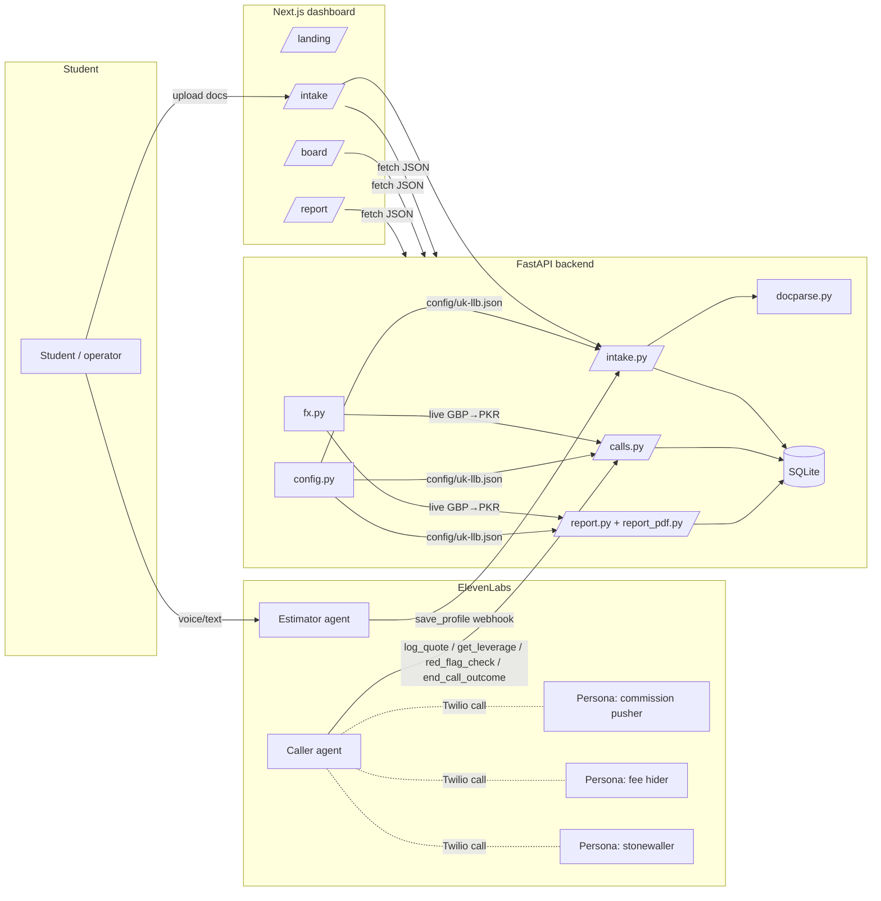

# Architecture

## 1. System overview



**One origin in production.** Caddy serves the Next.js app for all normal routes and reverse-proxies
`/api/*`, `/tools/*`, and `/health` to FastAPI. So the dashboard and the ElevenLabs webhooks share
one HTTPS hostname — no separate tunnel.

**Gated funnel.** The UI is a strict Intake → Caller → Report funnel enforced by a floating
step-flow bar (`components/shell/flow-bar.tsx`, gating in `lib/flow.ts`): Caller unlocks when a
profile is frozen; Report unlocks when a call has ended. The navbar no longer carries page links —
navigation goes through the gated bar (never rendered on `/`).

## 2. Request lifecycle (a full run)

0. **Select student.** `/intake` lists stored students (`GET /api/profiles`); the operator picks one
   (`POST /api/profiles/{id}/activate`) or adds a new one. The chosen student is the **active**
   student the rest of the flow operates on. At most one row is `active`; legacy dbs with none fall
   back to the most recent row.
1. **Intake.** The Estimator agent interviews the student and calls `POST /tools/save_profile`
   (partial merges) as it learns fields. Document uploads go to `POST /api/intake/document`, are
   parsed by `docparse.py`, and merge into the *same* draft. The dashboard `/intake` polls
   `GET /api/profile` (the active student) and lets the operator complete/correct anything.
2. **Freeze.** `POST /api/profile/confirm` validates the draft against
   `schemas/student-profile.schema.json` and stamps `frozen_at`. A frozen profile is immutable.
3. **Call.** The operator picks one of three fixed agencies (`GET /api/agencies`); `POST /api/calls`
   with `agency_id` resolves the display name + mapped persona, requires the **active** student's
   frozen profile, renders it into a plain-text `student_profile` block, and (unless `dry_run`)
   triggers an ElevenLabs outbound call over Twilio. **The dial target is always
   `VERIFIED_TARGET_NUMBER`** — the agency is only branding + a persona. A declined/unanswered call
   is closed via `POST /api/calls/{id}/cancel` so another agency can be tried.
4. **Mid-call.** The Caller agent calls `log_quote` per fee, `get_leverage` for competitor
   comparisons (DB only), and `red_flag_check` to validate figures against benchmarks. `/board`
   polls `GET /api/calls` every 2s and animates the negotiation live (dialing → ringing → forwarded
   → connected → ended).
5. **Close.** Every call ends via `end_call_outcome` (`quote | callback_commitment |
   documented_decline`).
6. **Report.** `GET /api/report` assembles a ranked, deterministic comparison; `/report` shows an
   agencies-contacted side-by-side comparison above the ranked recommendation. `GET /api/report/pdf`
   renders the same data as a branded PDF.

## 3. Backend architecture (`backend/app/`)

| File | Responsibility |
|---|---|
| `main.py` | FastAPI app; mounts the three routers; CORS; `init_db()` on startup; `/health`. |
| `db.py` | SQLite connection + schema (`student_profile`, `calls`, `quotes`, `red_flags`). One file, plain `sqlite3`. |
| `config.py` | Loads `config/<VERTICAL>.json` (cached). The only place domain knowledge enters. |
| `intake.py` | Estimator webhook (`save_profile`), document intake, draft merge, confirm/freeze, reset, the Estimator **voice-selection** endpoint, and **multi-student** list/activate (`GET /api/profiles`, `POST /api/profiles/{id}/activate`; `_current`/`_activate` manage the active pointer). |
| `docparse.py` | Document → partial profile. The only place OpenAI is touched (PDF text via pdfplumber, images via GPT-4o-mini vision). |
| `calls.py` | Caller webhooks (`log_quote`, `get_leverage`, `red_flag_check`, `end_call_outcome`), the agency dropdown (`GET /api/agencies`), outbound-call trigger (`POST /api/calls` with `agency_id`; always dials `VERIFIED_TARGET_NUMBER`; injects the **active** student's frozen profile), call cancel (`POST /api/calls/{id}/cancel`), live board endpoints. |
| `report.py` | Deterministic ranked report + `GET /api/report/pdf`. No LLM. |
| `report_pdf.py` | reportlab renderer for the downloadable PDF (imported lazily). |
| `fx.py` | Live GBP→PKR rate with in-memory + on-disk cache and graceful fallback. Never raises. |

**Design invariants**

- *Honesty by construction.* `get_leverage` only reads quotes from other **ended `quote`** calls;
  if none exist it returns `has_leverage: false` and instructs the agent to make no comparison.
  Red flags are computed only against `config` benchmarks.
- *Config, not code.* No university names, fees, personas, or currency live in Python.
- *Provider isolation.* OpenAI is confined to `docparse.py`; the FX provider to `fx.py`.

### Data model

```
student_profile(id, profile_json, confirmed, active, created_at)
calls(id, consultancy_name, phone, persona_id, conversation_id, started_at, outcome, outcome_detail, transcript_json)
quotes(id, call_id→calls, item, amount, currency, university, is_revised, revised_from, note, logged_at)
red_flags(id, call_id→calls, rule_id, detail, flagged_at)
```

`profile_json` is the entire `StudentProfile` as a JSON blob — so profile shape evolves in the JSON
Schema without a DB migration. Quote **revisions** are new rows with `is_revised=1` and
`revised_from`; `effective_rows()` collapses to the latest figure per line item. `active` (added by
an additive `init_db()` migration, same pattern as `quotes.revised_from`) marks the current working
student — at most one row is `active=1`; legacy dbs with none fall back to the most recent row, so
every existing caller behaves unchanged.

## 4. Frontend architecture (`frontend/`)

Next.js App Router (16), React 19, Tailwind v4. Pages are client components (they poll live data).

```
app/
  layout.tsx        Root: fonts, ThemeProvider, TopNav, FlowBar, metadata
  globals.css       Design tokens (dark-first) mapped into Tailwind via @theme
  page.tsx          Landing (single CTA → /intake)
  intake/page.tsx   Student picker + multi-step intake wizard (+ error.tsx per route)
  board/page.tsx    Live AI-caller dashboard (agency dropdown + call lifecycle)
  report/page.tsx   Analytics report (+ agencies-contacted comparison)
components/
  ui/               Primitives: button, card, badge, field, count-up
  shell/            top-nav (brand + theme only), page-container, flow-bar (gated stepper)
  theme-provider.tsx
  intake/           stepper, doc-uploader, voice-indicator, student-picker
  board/            live-call, waveform, agent-orb, transcript, quote-list, agency-caller
  report/           charts (Recharts), consultant-card, agencies-contacted
lib/
  api.ts            API base, shared types, apiFetch, effectiveRows/consultancyTotal
  utils.ts          cn(), money/secondary formatters, time/title helpers
  intake.ts         Steps, Zod schema, completion logic
  board.ts          Stage/confidence/transcript derivation
  flow.ts           Flow-bar gating (Caller needs a frozen profile; Report needs an ended call)
```

**Design system.** All colour is CSS variables (HSL channels) in `globals.css`, mapped to Tailwind
utilities (`bg-surface`, `text-muted`, `border-border`, `text-brand`…) via `@theme inline`. Dark is
the default; light is opt-in via `<html data-theme="light">` toggled by `ThemeProvider`. Animations
use Framer Motion; charts use Recharts; icons are Lucide.

**Data flow.** Each page owns its polling (`/intake` and `/board` poll; `/report` fetches on demand).
`lib/api.ts` centralises the base URL (`NEXT_PUBLIC_API_BASE`, empty = same-origin) and the shared
types, so a backend field is typed in exactly one place. The board's "live" feel (stage, confidence,
transcript) is **derived** in `lib/board.ts` from the same quote data the backend returns — no extra
transcript API is required.

## 5. Folder responsibilities (repo root)

| Path | Purpose |
|---|---|
| `backend/` | FastAPI app, SQLite DB, Dockerfile, requirements |
| `frontend/` | Next.js dashboard, Dockerfile |
| `agents/` | ElevenLabs system prompts (rendered from config), tool JSON configs, cue cards, persona setup guides |
| `config/` | Vertical configs; `uk-llb.json` active by default, `au-nursing.json` is a stub |
| `schemas/` | JSON Schemas for the profile, itemised quote, and vertical config (+ examples) |
| `scripts/` | `validate_config.py`, `build_call_list.py`, `render_agent_prompt.py`, `test_closer.py` |
| `deploy/` | `docker-compose.yml` + `Caddyfile` (one-box AWS) |
| `data/` | `call_list.json` (from OSM Overpass) + saved agent transcripts |
| `docs/` | This documentation set |

See [DEVELOPMENT.md](DEVELOPMENT.md) for how to run and extend each layer.
